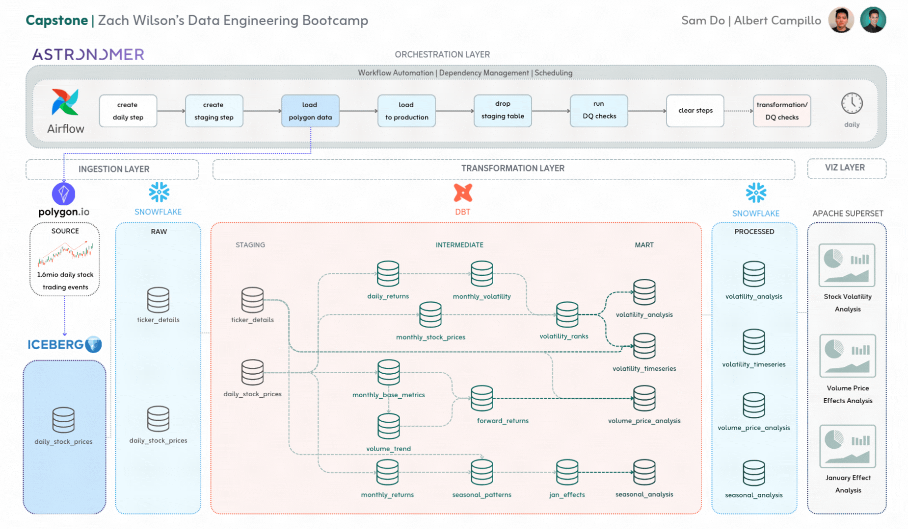

**📊 Stock Market Volatility & Seasonal Trends Analysis**

**DISCLAIMER**
 PLEASE NOTE THAT THIS IS JUST A TEMPLATE AND IS A ON-GOING PROJECT FOR PREVIEW, ALL SENSITIVE INFO SUCH AS CREDENTIALS ARE DELETED, SO YOU WONT BE ABLE TO RUN THE PROJECT
**PLEASE REACH OUT IF YOU HAVE ANY QUESTION!!**

====================

This draft is the first release of an ongoing project that explores key aspects of stock market behavior, focusing on volatility, trading volume spikes, and seasonal patterns:

High Volatility Stocks: Identifies stocks with the most significant monthly price fluctuations (measured by standard deviation of daily returns) and examines whether these stocks share common traits.

Trading Volume & Price Movements: Investigates whether spikes in monthly trading volume correlate with price changes in the following months.

January Effect Across Sectors: Analyzes how the well-known January Effect (stocks tending to rise in January) varies across different market sectors and whether its impact has changed over time.

This project leverages data analysis and visualization techniques to uncover insights into market behavior. 📈📉

**Linkedin contact:**

Sam Do : https://www.linkedin.com/in/sam-d-a51203149/

Albert Campillo: https://www.linkedin.com/in/albertcampillo/

**Table of Contents**

- [🚀 Getting Started](#getting-started)
  - [Prerequisites](#prerequisites)
  - [Local Development](#local-development)
    - [Debugging](#debugging)
  - [dbt Project Setup](#dbt-project-setup)
- [🚀 Project Summary](#Project-summary)
  - [Project Workflow](#Project-workflow)
      - [Key aspects](#key_aspects)
  - [Airflow DAG daily_raw_data_load_dag_v1](#airflow-dag-daily-raw-data-load-dag-v1)
  - [Airflow DAG back_fill_raw_data_load_dag_v1](#airflow-dag-back_fill-raw-data-load-dag-v1)
  - [Data Modeling & Transformation](data-modeling-&-transformation#)
  - [Project Key Questions](#Project-key-questions)
    - [Question 1](#Question_1)
    - [Question 2](#Question_2)
    - [Question 3](#Question_3)
  - [Data Visualization](#data_visualization)
  - [Next Step](#next_step)

    
# **🚀 Getting Started**



## **Prerequisites**

1. **Install [Docker](https://docs.docker.com/engine/install/)**: Docker is a platform for packaging, distributing, and managing applications in containers.
2. **Install the [Astro CLI](https://docs.astronomer.io/astro/cli/install-cli)**: Astro CLI is a command-line tool designed for working with Apache Airflow projects, streamlining project creation, deployment, and management for smoother development and deployment workflows.

## **Local Development**

1. **Clone the Repository**: Open a terminal, navigate to your desired directory, and clone the repository using:
    ```bash
    git clone git@github.com:bigchungus2303/Stocks-analysis-ETL.git # clone the repo
    cd Stocks-analysis-ETL # navigate into the new folder
    ```

    1. If you don’t have SSH configured with the GitHub CLI, please follow the instructions for [generating a new SSH key](https://docs.github.com/en/authentication/connecting-to-github-with-ssh/generating-a-new-ssh-key-and-adding-it-to-the-ssh-agent) and [adding a new SSH key to your GitHub account](https://docs.github.com/en/authentication/connecting-to-github-with-ssh/adding-a-new-ssh-key-to-your-github-account?tool=cli) in the GitHub docs.
2. **Docker Setup and Management**: Launch Docker Daemon or open the Docker Desktop app
3. **Run the Astro Project**:
    - Start Airflow on your local machine by running **`astro dev start`**
        - This will spin up 4 Docker containers on your machine, each for a different Airflow component:
            - **Postgres**: Airflow's Metadata Database, storing internal state and configurations.
            - **Webserver**: Renders the Airflow UI.
            - **Scheduler**: Monitors, triggers, and orchestrates task execution for proper sequencing and resource allocation.
            - **Triggerer**: Triggers deferred tasks.
        - Verify container creation with **`docker ps`**
    - **Access the Airflow UI**: Go to http://localhost:8081/ and log in with '**`admin`**' for both Username and Password
        >
        > ℹ️ Note: Running astro dev start exposes the Airflow Webserver at port **`8081`** and Postgres at port **`5431`**.
        >
        > If these ports are in use, halt existing Docker containers or modify port configurations in **`.astro/config.yaml`**.
        >
4. **Stop** the Astro Docker container by running `**astro dev stop**`
    >
    > ❗🚫❗  Remember to stop the Astro project after working to prevent issues with Astro and Docker ❗🚫❗
    >


**⭐️ TL;DR - Astro CLI Cheatsheet ⭐️**

```bash
astro dev start # Start airflow
astro dev stop # Stop airflow
astro dev restart # Restart the running Docker container
astro dev kill # Remove all astro docker components
```

### **Debugging**

If the Airflow UI isn't updating, the project seems slow, Docker behaves unexpectedly, or other issues arise, first remove Astro containers and rebuild the project:

- Run these commands:
    ```bash
    # Stop all locally running Airflow containers
    astro dev stop

    # Kill all locally running Airflow containers
    astro dev kill

    # Remove Docker container, image, and volumes
    docker ps -a | grep dataexpert-airflow-dbt | awk '{print $1}' | xargs -I {} docker rm {}
    docker images | grep ^dataexpert-airflow-dbt | awk '{print $1}' | xargs -I {} docker rmi {}
    docker volume ls | grep dataexpert-airflow-dbt | awk '{print $2}' | xargs -I {} docker volume rm {}

    # In extreme cases, clear everything in Docker
    docker system prune
    ```

- Restart Docker Desktop.
- (Re)build the container image without cache.
    ```bash
    astro dev start --no-cache
    ```


## dbt Project Setup

- Go to the project's directory
  ```bash
  cd dbt_project
  ```
- Create a venv to isolate required packages
  ```bash
  python3 -m venv venv # MacOS/Linux
  # or
  python -m venv venv # Windows/PC
  ```
- Source the virtual environment
  ```bash
  source venv/bin/activate # MacOS/Linux
  # or
  venv/Scripts/activate # Windows/PC
  ```
- Install the required packages
  ```bash
  pip3 install -r dbt-requirements.txt # MacOS/Linux
  # or
  pip install -r dbt-requirements.txt # Windows/PC
  ```
- Update `DBT_SCHEMA` environment variable
  - MacOS/Linux:
    - Open the `dbt.env` file, change the `DBT_SCHEMA` to your schema from Weeks 1 and 2, and source the environment variables to your local (terminal) environment
      ```bash
      export DBT_SCHEMA='your_schema' # EDIT THIS FIELD
      ```
    - then run
      ```bash
      source dbt.env
      ```
  - Windows/PC:
    - Instead of overwriting the DBT_SCHEMA in the file you can run:
      - CMD:
      ```bash
      set DBT_SCHEMA=your_schema

      # For example
      set DBT_SCHEMA=john #(without quotes)
      ```
      - PowerShell:
      ```bash
      $env:DBT_SCHEMA = "your_schema"
      ```


- Run `dbt debug` to check your connection. You should see a message like this:
    ```
    13:43:43  Running with dbt=1.9.0-b3
    13:43:43  dbt version: 1.9.0-b3
    13:43:43  python version: 3.9.6
    13:43:43  python path: .../dbt-basics/venv/bin/python3
    13:43:43  os info: macOS-15.1-arm64-arm-64bit
    13:43:44  Using profiles dir at .
    13:43:44  Using profiles.yml file at ./profiles.yml
    13:43:44  Using dbt_project.yml file at ./dbt_project.yml
    13:43:44  adapter type: snowflake
    13:43:44  adapter version: 1.8.4
    13:43:44  Configuration:
    13:43:44    profiles.yml file [OK found and valid]
    13:43:44    dbt_project.yml file [OK found and valid]
    13:43:44  Required dependencies:
    13:43:44   - git [OK found]

    13:43:44  Connection:
    13:43:44    account: aab46027.us-west-2
    13:43:44    user: dataexpert_student
    13:43:44    database: DATAEXPERT_STUDENT
    13:43:44    warehouse: COMPUTE_WH
    13:43:44    role: ALL_USERS_ROLE
    13:43:44    schema: john
    13:43:44    authenticator: None
    13:43:44    oauth_client_id: None
    13:43:44    query_tag: john
    13:43:44    client_session_keep_alive: False
    13:43:44    host: None
    13:43:44    port: None
    13:43:44    proxy_host: None
    13:43:44    proxy_port: None
    13:43:44    protocol: None
    13:43:44    connect_retries: 0
    13:43:44    connect_timeout: 10
    13:43:44    retry_on_database_errors: False
    13:43:44    retry_all: False
    13:43:44    insecure_mode: False
    13:43:44    reuse_connections: True
    13:43:44  Registered adapter: snowflake=1.8.4
    13:43:50    Connection test: [OK connection ok]

    13:43:50  All checks passed!
    ```


You're good to go!

# dbt airflow 

Remember that, if you are running this project for the first time, dbt will ask you to run

```bash
$ dbt deps
```

to install the packages defined in packages.yml
After this, run:

$ dbt build

# Other helpful resources for learning!

### :whale: Working with Docker

> :bulb: Understanding Docker Images and Containers:
>
>
> Docker provides lightweight and isolated environments for consistent application execution across different systems. Containers encapsulate an application's code, libraries, and dependencies into a portable unit, ensuring reproducible environments. Docker images capture snapshots of filesystems, while containers represent running instances of those images.
>
> In simple terms, you can think of Docker as a tool that creates special "boxes" for software. These boxes include everything the software needs to run, like its instructions and tools. Docker also takes pictures of these boxes, called images, to use later. When you want to use the software, you open one of these pictures, and that creates a real working "box" called a container.
>
> To learn more, explore Docker's official [Getting Started](https://docs.docker.com/get-started/) guide. For a comprehensive understanding, watch this informative [YouTube video](https://www.youtube.com/watch?v=pg19Z8LL06w) by TechWorld with Nana.
>

Here are some helpful commands to remember as you get used to working with Docker:

- To check if you have any running Docker containers, use:
    ```bash
    docker ps      # List all available containers
    docker container ls   # Equivalent to above
    docker ps -a     # List running containers
    docker container ls -a   # Equivalent to above
    ```

- To list all Docker images locally:
    ```bash
    docker images
    ```

- Use the command below to remove an image. This is useful to free up space when you have unused images. Replace `<IMAGE ID>` with the actual image ID, which you can find by running **`docker images`**.
    ```bash
    docker rmi <IMAGE ID>
    ```

- Use the **`docker prune`** command to remove/reset Docker resources. This is especially handy to clean up resources and reclaim disk space.
    ```bash
    docker images prune
    docker container prune
    docker volume prune
    docker system prune
    ```

- To learn more about Docker, check out these resources below:
    - [Docker Overview](https://docs.docker.com/get-started/)
    - Enhance your Docker knowledge with this enlightening [YouTube Tutorial](https://www.youtube.com/watch?v=pg19Z8LL06w) by TechWorld with Nana

### 📂 Navigating the Repository

> :bulb: Learn more about the features of an Astro project here!
>

Each Astro project contains various directories and files. Learn more about the structure of our Astro project below:

- **`dags`**: This directory houses Directed Acyclic Graphs (DAGs), which represent the workflows in Apache Airflow. Note: it's highly encouraged that you create DAGs in subfolders so that you can make use of the `.airflowignore` file when testing locally. Learn more below:
    - **`community/`**: Stores default example DAGs for training and local testing.
    - **`.airflowignore`**: Use this file to exclude folders from the Airflow scheduler, handy for local testing and avoiding production changes.
- **`Project-dbt_2`**: Here lies the dbt project, accessible both locally for testing and development, and within Airflow to be used in our DAGs.
- **`Project-superset`**: the visualisation part for the project
- **`Dockerfile`**: This file is based on the Astro Docker image and can be customized to include project-specific commands and/or overrides for runtime behavior. Understanding this file is optional but you're welcome to explore if you wish to dive deeper into Astro.
- **`include`** contains additional project files:
- **`requirements.txt`**: Install Python packages needed for your project by adding them to this file.
- **`airflow_settings.yaml`**: Use this local-only file to define Airflow Connections, Variables, and Pools. This allows you to manage these configurations locally instead of via the Airflow UI during DAG development.

# **🚀 Project Summary**
## **Project Workflow:**
This workflow represents a comprehensive pipeline that processes stock market data through ingestion, transformation and visualization layers, all orchestrated by Apache Airflow
### **Key aspects:**
- Orchestration Layer: Apache Airflow manages the workflow automation, dependency management, and scheduling of tasks including daily ETL processes, quality checks, and data loading.
- Ingestion Layer: Data is sourced from Polygon.io and leveraged into an Iceberg table, then loaded into Snowflake RAW tables.
- Transformation Layer: DBT handles transformations across staging, intermediate, and mart layers, processing various financial metrics including volatility, returns, and seasonal patterns.
- Visualization Layer: Apache Superset provides dashboards for stock volatility, volume price effects, January effects analysis (key questions to answer as part of this Project)


## Airflow DAG daily_raw_data_load_dag_v1:
- DAG Definition and Orchestration

- The script defines an Airflow DAG named back_fill_raw_data_load_dag_v1 that orchestrates the entire backfill process. Each step in the data flow is represented as an Airflow task, and these tasks are chained to ensure they run in the correct order.


- Staging vs. Production Tables


  - Iceberg Staging Table Within the script, uses Tabular (via the pyiceberg library) to create the Iceberg table library to create and load data into a table named staging_table (e.g., bigchungus0148.stock_prices_version5_stg_20250228_v5) if it does not exist. This creation is handled by create_iceberg_table_if_not_exists(). Data is appended through 
    table.append(arrow_table).
  - Trino Staging Table There is also a Trino-facing staging table of the same name. The script runs a CREATE TABLE IF NOT EXISTS query via execute_trino_query(...) to ensure Trino recognizes this staging table. This allows you to query the same underlying data from Trino.
  - Production Table The production table (e.g., bigchungus0148.stock_prices_version5) is also created if it does not exist. Data will ultimately be inserted into this table, which is intended to be the final, deduplicated dataset.

- Data Extraction (Polygon API)


  - Fetching Data The core logic for pulling data from the Polygon API resides in fetch_all_stock_data_for_range(). Instead of fetching day by day, the script calls Polygon once per ticker for the requested date range. Each API response contains daily bars (open, high, low, close, volume) for the ticker.
  - Transformation to PyArrowAs the script processes each Polygon response, rows are created (ticker, date, open, close, volume, high, low) and accumulated in a Python list. That list is then turned into a pyarrow.Table, which becomes the staging data structure.

- Loading into Iceberg

  - Once the PyArrow table is assembled, it is appended to the Iceberg staging table using table.append(arrow_table). This happens in the main() function:

    - Table Creation (if needed) by create_iceberg_table_if_not_exists()
    - Data Retrieval from Polygon by fetch_all_stock_data_for_range()
    - Data Append by append_data_to_iceberg(...)

- Inserting into Production

 After data lands in the Iceberg/Trino staging table, there is a Trino INSERT query that moves new rows from staging into the production table. It also calculates a row number (rn) in case you need to identify duplicates:

```sql
INSERT INTO {production_table}
SELECT
    ticker,
    date,
    open,
    close,
    volume,
    high,
    low,
    row_number() OVER (PARTITION BY ticker, date ORDER BY date DESC) AS rn,
    current_date AS upload_d
```

- Data Quality Check and Cleanup

  - DQ CheckA quick check (SELECT * FROM production_table WHERE rn > 1) is used to see if any duplicates were inserted.
  - Duplicate RemovalA subsequent DELETE FROM production_table WHERE rn > 1 removes any duplicates that appear.
  - Staging Table TeardownFinally, the script drops the staging table in Trino to keep things tidy.

- Run dbt model for Gold layer
  - Once the cleaning step is done, the dag will run the last step which is start running the dbt model with command:
```bash
dbt build
```
 - The dbt model will run tests and create staging and prod tables for reporting purposes based on the tickers activity and tickers details.

- Airflow Tasks and Flow
  The DAG’s tasks execute in this sequence:
    - create_daily_step → Creates production table if it doesn’t exist.
    - create_staging_step → Creates Trino staging table if it doesn’t exist.
    - load_polygon_data → Calls main(), which creates/loads the Iceberg table and fetches data from Polygon.
    - load_to_production_step → Inserts data from staging to production.
    - drop_staging_table → Drops the staging table from Trino.
    - run_dq_check → Validates duplicates.
    - cleaning_step → Deletes duplicates from production.
    - run_dbt_model → Run dbt models to produce production data for reporting and analytics purposes

## Airflow DAG back_fill_raw_data_load_dag_v1:
- All steps are similar to daily DAG except for step 9 run dbt models.
- In addition, this DAG is performed specifically for backfilling purpose and will only be triggered manually.
- User can adjust date period in function daily_raw_data_load_dag_v1() for backfill purpose.


## Data Modeling & Transformation:
- As described in the DAG task flow, the 8th and final step initiated a data transformation workflow defined in Data Build Tool (DBT).
- The choice of leveraging the Polygon API responded to our personal interest in the stock market and the goal to answer several questions regarding stock performance not commonly covered in such type of analysis.
- We focused on 3 main questions (explained in detail below), for which we came up with a transformation workflow encompassing:
  - 2 staging models
  - 10 intermediate models
  - 4 mart models
  - 89 data tests


- Answering these questions also gave us a good opportunity to leverage many of the advanced analytical patterns covered during the bootcamp, which we developed in depth in the SQL queries used to build our models.
- Each of the subsequent models builds upon the two staging models resulting from the Polygon API sourced data:
  - stg_daily_stock_prices
    This staging model standardizes and cleanses the raw daily stock price data, performing essential data quality checks and type casting. It adds derived date parts for easier aggregation and filtering in downstream models, and includes a unique row identifier to prevent duplicates. The model also implements data quality filters to ensure only valid records with     non-zero close prices are processed.
  - stg_
    This staging model processes ticker-to-sector mappings, standardizing sector and industry classifications and ensuring there are no null values by defaulting them to 'Unknown'. The model generates a unique ticker identifier which will be used for joining operations in downstream transformations, ensuring data integrity in the dimensional model.

## Project Key Questions:
Hereby the questions covered in this Project, as well as all the intermediate and mart models developed for each purpose.

### **Question 1:**
“Which stocks consistently show the highest monthly price volatility (measured by the standard deviation of daily returns), and do these volatile stocks share common characteristics?”

- int_daily_returns 
  - This model calculates the day-to-day percentage price changes for each stock, creating the foundation for volatility analysis.
    - Essential for computing volatility metrics, which are based on the standard deviation of daily returns
    - Provides clean, validated return data by handling edge cases like zero/negative prices

- int_monthly_volatility 
  - This model aggregates daily return variations into monthly volatility metrics, including standard deviation, Sharpe ratio, and return ranges.
    - Directly addresses the core question by calculating monthly volatility (standard deviation of daily returns)
    - Computes multiple risk metrics to provide a comprehensive volatility profile for each stock-month

- int_monthly_stock_prices 
  - This model aggregates daily price data to monthly level, capturing open/close prices, high/low ranges, and volume information.
    - Provides essential context about price movements accompanying volatility
    - Enables analysis of whether volatility manifests as upward or downward price movements

- int_volatility_ranks 
  - This model ranks stocks by volatility within each month and calculates percentiles to identify relative volatility levels.
    - Establishes which stocks have relatively high volatility compared to the broader market
    - Creates categorical classifications of volatility for easier pattern identification and filtering

- fact_stock_volatility_analysis 
  - This model identifies stocks with consistent volatility patterns over time by aggregating monthly volatility metrics and calculating the frequency of high-volatility periods.
    - Directly answers the first part of the question by finding stocks that consistently show high volatility
    - Includes sector/industry classification to address the second part about common characteristics shared by volatile stocks

- fact_monthly_volatility_timeseries 
  - This mart provides month-by-month volatility metrics for each stock, tracking changes and trends in volatility over time.
    - Enables temporal analysis of how volatility evolves, which supplements understanding of consistency
    - Allows comparison of volatility patterns across sectors and market regimes, providing deeper context for what causes certain stocks to be consistently volatile
    - Helps identify if volatile periods cluster in time, revealing how persistent volatility traits are for different stocks

### **Question 2:**
Is there a correlation between monthly trading volume spikes and subsequent price movements in the following months?


- int_monthly_base_metrics  
  - This intermediate model establishes the foundational monthly metrics needed to analyze volume spikes and price movements. By aggregating daily stock data to a monthly level, it:
    - Creates volume metrics (monthly total and daily average), crucial for identifying volume spikes
    - Captures key price points (open, close, high, low), used to measure price movements
    - Calculates derived metrics like monthly returns and price ranges to quantify price movements.

- int_volume_trend_analysis
  - This intermediate model helps to analyze volume trends and identify volume spikes, as it:
    - Establishes a baseline for "normal" trading volume using a 6-month moving average
    - Quantifies volume spikes as ratios compared to this baseline
    - Categorizes the magnitude of volume spikes into meaningful business categories.
    - Creates an initial categorization of how volume spikes relate to concurrent price movements
    - Provides the foundation for analyzing if these volume spikes precede specific price movement patterns

- int_forward_returns
  - This intermediate model directly addresses the "subsequent price movements" part of the business question:
    - It calculates forward returns for 1, 2, and 3 months after a volume spike occurs
    - It creates a cumulative 3-month return to measure longer-term impact
    - It flags whether returns are positive or negative, creating simple indicators for directional analysis.
    - It maintains the context of what type of volume spike occurred so we can compare outcomes by spike category

- fact_volume_price_analysis
  - The final mart model answers the main question about correlation between volume spikes and subsequent returns:
    - It groups data by volume spike categories to identify different types of volume anomalies
    - It calculates forward returns (1-month and 3-month) following these volume spikes
    - It computes success rates (percentage of positive returns) for different volume spike categories
    - It provides detailed distribution statistics (percentiles) for returns
    - It includes sector and industry dimensions to allow for analysis of these patterns across market segments

### **Question 3:**
How does the January Effect (the tendency for stocks to rise in January) manifest across different market sectors, and has its strength changed over the years?

- int_monthly_returns
  - This intermediate model calculates monthly return metrics for each stock ticker, which forms a foundational component for analyzing the January Effect.
    - Establishes monthly timeframes (monthly aggregations needed to analyze the January effect)
    - Calculates returns, the central metric to measure stock performance in January vs. other months.
    - Provides context, as volume and trading day metrics help assess liquidity and trading activity

- int_seasonal_patterns
  - This intermediate model builds on the monthly returns data to create a more sophisticated analysis table that includes:
    - Creation of statistical benchmarks, as it calculates historical averages and standard deviations per month to identify unusual performance.
    - Returns normalization: The z-score calculation allows for standardized comparison across different stocks and time periods
    - Consistency tracking: the positive return flag helps measure how reliably the January effect occurs
    - Volume context: Volume vs. 12-month average helps identify unusual trading activity

- int_january_effect_metrics
  - This intermediate model measures the January effect for each stock and year
    - Directly measures the January effect, calculating how much January returns differ from other months
    - Provides statistical context, as includes the Z-score that shows whether January outperformance is statistically significant
    - Includes adjacent months (December/February) to analyze spillover effects
    - Creates categorical measures: The strength classification allows for simplified analysis of trends
    - Preserving sector information for cross-sector comparison

- fact_seasonal_analysis
The final mart model helps answer the main question of how does the January effect manifest across different market sectors and whether its effect has changed over the years?

## Data Visualization: 
- Finally, we leveraged Apache Superset, an open-source data visualization tool, to bring a visual approach to each of these questions.
- The end result is a three-page dashboard containing a set of charts that will help the user answer each of the key questions described above.
- Hereby a snapshot of each dashboard view:
Question 1


Question 2


Question 3


## Next Step:
- Identify issue in the pipeline and find resolution
- Migrate the visualisation to a more capable platform (superset has many limitations)
- Add another pipeline to identify stocks that got split
- Add another pipeline for data streaming
- ...
